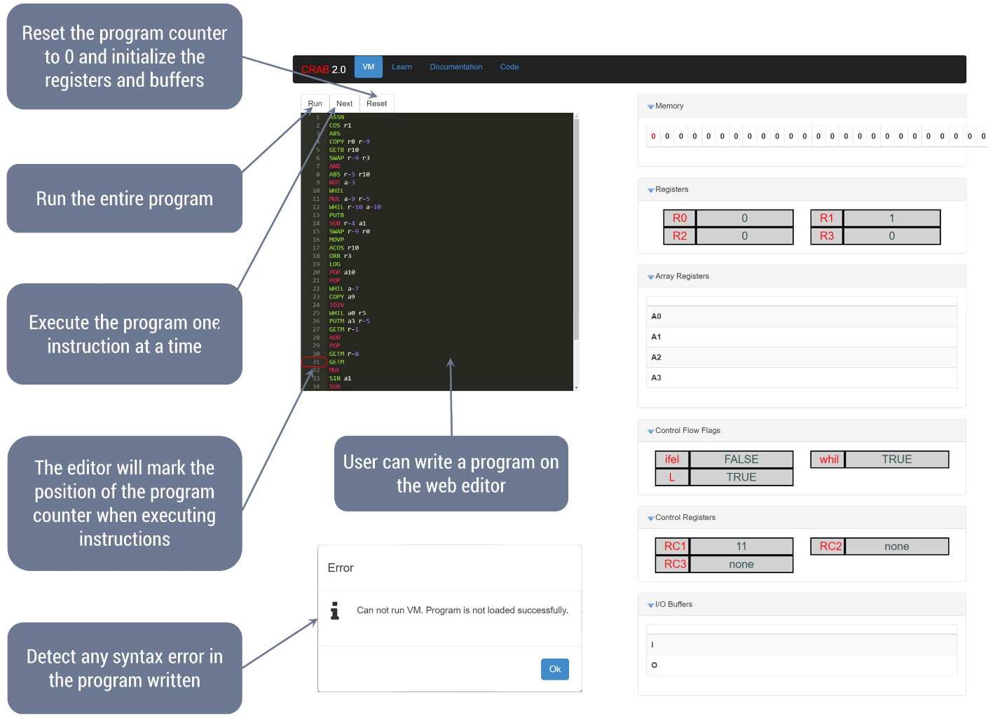

# CRAB2.0--VM

# Authors: Dr. Nawwaf Kharma and Tawfiq Jawhar
### This language and/or the VM can not be used without the permision of one of the authors.

CRAB 2.0 is an assembly language that runs on a virtual machine designed for effecient evolution of programs; Linear Genetic Programming.
## Default Operands
The idea behind the design that every instruction can have any number of operands compared to other assembly languages that require 2 or 3 operands.
The language defines default operations for instructions with no operands, one operand and two operands.

For example:

```
add
```
will increment register 0
```
add rX
```
will increment register X
```
add rX, rY
```
will store in register X the sum of the values of register X and Y

The VM also has array registers, where a full array of floating point numbers can be stored in one register. And one single instruction can handle array operations.
The behaviour is similar to numpy arrays.
```
mul aX
```
will multipy every element in the array register X by 2
```
mul aX, aY
```
will result in: aX[i] *= aY[i] for all i
```
mul aX, rY
```
will multiply every element of array register X by the value of register Y
## Robust Language
In order to evolve an assembly language, the design makes sure that any combination of instructions and values will always run on the VM.
For example, if the number of registers available are 4 (0 to 3) and the program is accessing register 5, then the VM will access register 5 module 4 which will result in R1.

## Wt User Interface
The VM has a web user interface built with Wt in C++.
The UI allows the user to write a CRAB2.0 program with syntax highlighting and run the full program or instruction by instruction while keeping track of the program counter's position.


